**Submódulo:**

**Construye aplicaciones web**

Herrera Alaniz Carlos Enrique

Jimenez Aquino Saul Enrique

Morales Garcia Tania Guadalupe

Oriza Gastelum Alondra Guadalupe

Vazquez Martinez Claudia Michelle

5AMPG

ÍNDICE

1.  Introducción..............................................................................2

2.  Comandos...............................................................................3

3.  MVT........................................................................................4

4.  Settigs.py, urls.py, models.py, views.py y
    > templates/store.....................5

5.  Código de los archivos
    > ................................................................7

6.  Ejecución.................................................................................9

7.  Códigos Forms.py, [Views.py](http://views.py), Explicar decorador,
    > [Urls.py](http://urls.py), store/templates ..13

8.  Conclusión...............................................................................21

Introducción

Django es un framework de desarrollo web de alto nivel, gratuito y de
código abierto, escrito en Python. Su popularidad se basa en el concepto
de "Baterías incluídas" (Batteries included), que busca acelerar el
desarrollo de aplicaciones complejas, seguras y estables, adhiriéndose
al principio de "No Te Repitas" (DRY).

La ventaja principal de Django es su capacidad de desarrollo rápido (RAD). Proporciona
soluciones preconstruidas y robustas para tareas que de otra manera consumirían mucho tiempo. Esto incluye ORM (Mapeo Objeto-Relacional) que permite a los desarrolladores interactuar con bases de datos usando codificación a base de python en vez de SQL, y un panel de administración que se genera automáticamente, facilitando la gestión de contenido sin la necesidad de programar un backend desde cero. Además, maneja de forma integrada
sistemas esenciales como la autenticación de usuarios, sesiones y cacheos.

Otra razón para elegir Django es su seguridad intrínseca. El framework
está diseñado específicamente para mitigar automáticamente amenazas web
críticas, como la inyección SQL, el Cross-Site scripting (XSS) y la
Falsificación de Solicitudes en Sitios Cruzados (CSRF), lo que lo
convierte en una opción viable para proyectos
empresariales.

> Finalmente su escalabilidad y su ecosistema son grandes atractivos. Al
> estar basado en Python, un lenguaje versátil y maduro, Django es capaz
> de soportar arquitecturas de tráfico masivo(como las que usan empresas
> como Instagram y Spotify). Además, se beneficia de la vasta colección
> de librerías de Python para tareas avanzadas (como machine learning y
> análisis de datos), ofreciendo una versatilidad sin igual y contando
> con una comunidad de desarrolladores activa y una documentación
> extensa.

Comandos

**3. Explicación con sus propias palabras de cada comando que vimos en
clase por ejemplo \"venv\\Scripts\\activate\", pip install django,
django-admin startproject marketplace_main.**

-   **cd documents:** Te mueve a la carpeta llamada documents desde
    > donde estás. Es para cambiar de directorio.

-   **md nombre:** Crea una nueva carpeta (directorio) con el nombre
    > nombre en tu ubicación actual.

-   **cd nombre:** Te mueves *dentro* de la carpeta que acabas de crear
    > (nombre).

-   **code .**: Abre el editor de código (como Visual Studio Code) para
    > ver y editar todos los archivos de la carpeta actual.

-   **dir:** Muestra una lista de todos los archivos y subcarpetas
    > dentro del directorio actual.

-   **python -m venv venv:** Crea una carpeta llamada venv que contiene
    > un entorno de desarrollo aislado para tu proyecto.

-   **venv\\Scripts\\activate:** Ejecuta un *script* para activar ese
    > entorno virtual, aislando las librerías del proyecto.

-   **pip install django:** Descarga e instala el *framework* Django en
    > tu entorno virtual activo.

-   **pip list:** Muestra una lista de todas las librerías instaladas en
    > tu entorno virtual (para verificar que Django esté ahí).

-   **cd marketplace_main:** Te mueves al directorio principal de tu
    > proyecto Django.

-   **manage.py:** Es el archivo principal que usas para interactuar con
    > tu proyecto Django desde la línea de comandos.

-   **python manage.py runserver:** Inicia el servidor web temporal de
    > Django para que puedas ver el proyecto en tu navegador. copiar
    > liga
    > [[http://127.0.0.1:8000/]{.underline}](http://127.0.0.1:8000/) Es
    > la dirección que copias y pegas en el navegador para acceder a tu
    > sitio web local.

-   **para borrar el servidor es: control c:** Es la combinación de
    > teclas para detener el servidor que está corriendo.

-   **python manage.py createsuperuser:** Inicia el proceso para crear
    > una cuenta de administrador con acceso total al panel de Django.

-   **manage.py migrate:** Aplica los cambios a la base de datos y crea
    > todas las tablas necesarias para las funcionalidades internas de
    > Django.

-   **python manage.py startapp store:** Crea un nuevo módulo o
    > aplicación llamada store dentro de tu proyecto Django (ej. para
    > manejar productos, usuarios, etc.).

-   **pip install pillow:** Instala la librería Pillow, necesaria en
    > Django para gestionar el manejo de imágenes.

-   **python manage.py makemigrations:** Revisa los cambios que hiciste
    > en tus modelos (estructura de la base de datos) y crea los
    > archivos para actualizarla.

-   **python manage.py migrate:** Aplica esos archivos de migración
    > creados para que los cambios se reflejen realmente en la base de
    > datos.

**4. Elabore un diagrama y una explicación con sus propias palabras de
la arquitectura MVT que utiliza Django**

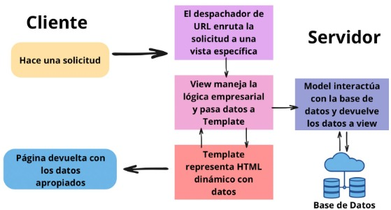

La arquitectura MVT (Model-View-Template) es la forma en que Django
organiza una aplicación web. El Model maneja los datos y la base de
datos, el View contiene la lógica que decide qué mostrar, y el Template
es la parte visual que ve el usuario.

Cuando un usuario hace una petición, Django busca la vista
correspondiente, esta obtiene los datos del modelo, los envía al
template y finalmente se genera una página HTML que se devuelve al
usuario.

**5. Explicación con sus propias palabras de los archivos settigs.py,
urls.py, models.py, views.py y finalmente para que sirve el foder
templates/store.**

settigs.py

El archivo settings.py es uno de los archivos más importantes dentro de
un proyecto de

Django. Su función principal es almacenar toda la configuración del
proyecto, es decir,

los parámetros que Django necesita para funcionar correctamente.

Dentro de este archivo se encuentran definidas varias configuraciones
esenciales,

como:

INSTALLED_APPS: indica las aplicaciones que están activas dentro del
proyecto y que

Django debe reconocer.

DATABASES: contiene la configuración de la base de datos (por ejemplo,
tipo de base

de datos, nombre, usuario y contraseña).

TEMPLATES: define cómo se manejarán las plantillas HTML del proyecto.

STATIC_URL y MEDIA_URL: especifican las rutas donde se guardan los
archivos

estáticos (imágenes, CSS, JavaScript) y los archivos subidos por los
usuarios.

MIDDLEWARE: lista los componentes que procesan las peticiones y
respuestas entre

el navegador y el servidor.

DEBUG y ALLOWED_HOSTS: controlan el modo de desarrollo y los dominios permitidos para ejecutar el sitio web.

urls.py

El archivo urls.py tiene la función principal de controlar las rutas o
direcciones (URLs) que utiliza un proyecto de Django para acceder a las diferentes páginas o vistas del sitio web.

Cuando un usuario escribe una dirección en el navegador, Django utiliza
este archivo para determinar qué parte del código debe ejecutarse y qué contenido mostrar.
En otras palabras, el urls.py actúa como un mapa de navegación que conecta las
direcciones web con las funciones o vistas que deben responder a esas peticiones.

Dentro del archivo se definen patrones de URL mediante una lista llamada
urlpatterns, donde se asocian rutas con vistas.

Además, urls.py permite organizar las rutas de manera modular, ya que
cada aplicación dentro del proyecto puede tener su propio archivo urls.py, y todas
pueden conectarse al archivo principal del proyecto mediante la función include().

models.py

El archivo models.py es donde se define toda la parte de los datos de
una aplicación en Django.

Ahí es donde se crean las clases que representan las tablas de la base
de datos, por ejemplo una tabla de productos, usuarios o pedidos.

Cada modelo tiene sus campos, como nombre, precio, descripción o fecha,
y Django usa esa información para crear automáticamente las tablas en la base de
datos, sin que uno tenga que escribir código SQL.

En pocas palabras, el models.py sirve para decirle a Django qué tipo de
información va a

guardar la aplicación y cómo va a estar organizada.

Es como la base o la estructura de los datos que después se usan en las
vistas y en las

páginas del proyecto.

[views.py](http://views.py)

El archivo views.py en una aplicación de Django es el que se encarga de
la parte lógica,

o sea, de decidir qué va a pasar cuando un usuario entra a una página.

Por ejemplo, si alguien visita una ruta, el views.py puede mostrar una
lista de

productos, los detalles de uno, o guardar datos de un formulario.

Básicamente, las vistas reciben la petición del usuario y devuelven una
respuesta, ya

sea un texto, una página HTML o información desde la base de datos.

Es como el punto medio entre lo que el usuario pide y lo que Django
muestra.

En pocas palabras: el views.py es el cerebro que controla qué se ve y
qué se hace

dentro de cada parte del proyecto.

templates/store

La carpeta templates/store es una convención de Django que organiza los
archivos HTML utilizados para renderizar la interfaz de usuario
específica de una aplicación llamada, en este caso, \"store\". Actúa
como el módulo de presentación (la \"P\" de MTV - Modelo, Plantilla,
Vista) donde reside todo el diseño web y la estructura visual.

**6. Agregue el código por cada explicación de los archivos antes
mencionados.**

**settings.py:**

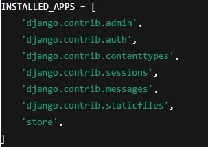

**urls.py:**

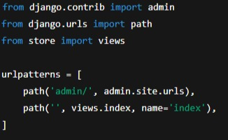

**models.py:**

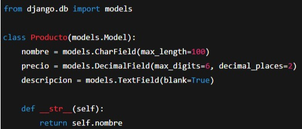

**views.py:**

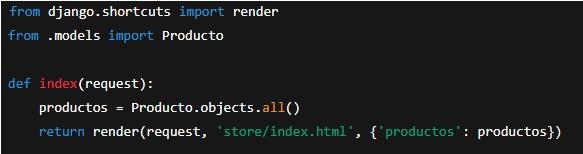

**templates/store/index.html:**\
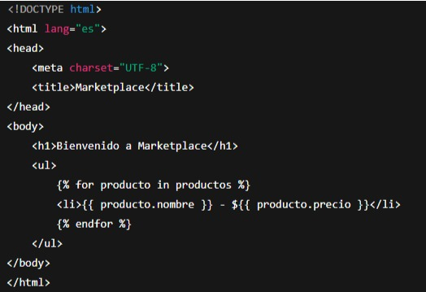

**7. Agregue la ejecución de lo que va del proyecto**

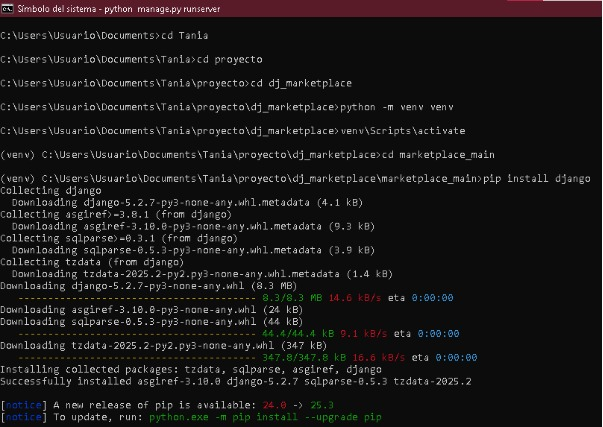

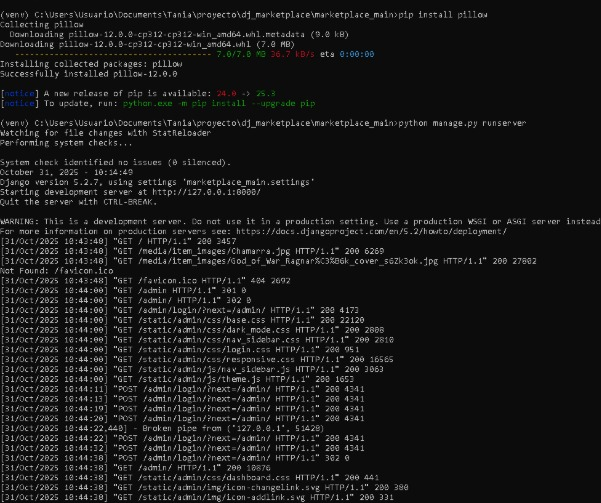

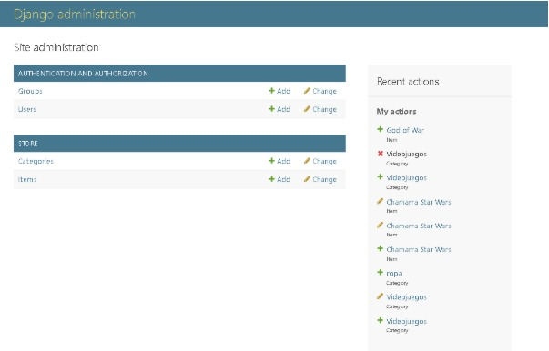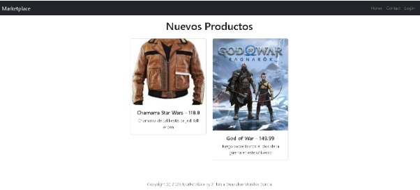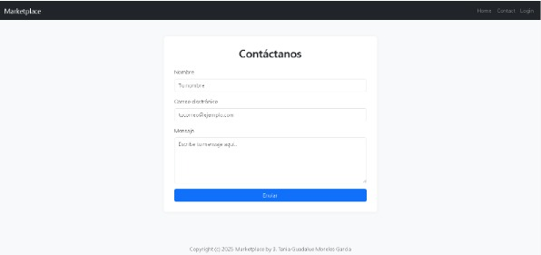
**Forms.py (LoginForm, SignupForm, NewItemForm)**

En este archivo se definen los formularios que utiliza la aplicación
para interactuar con el usuario. Estos formularios permiten capturar
información de manera estructurada y validarla antes de enviarla a la
base de datos o procesarla en una vista.

**LoginForm**

Es un formulario sencillo diseñado para que un usuario pueda iniciar
sesión.\
Consta de dos campos:

username: el nombre de usuario registrado.

password: la contraseña del usuario (se muestra oculta por seguridad).

Su función principal es recibir las credenciales del usuario y enviarlas
a la vista encargada del proceso de autenticación.

**SignupForm**

Formulario utilizado para registrar nuevos usuarios.\
Incluye campos como:

username, email, password1 y password2

Este formulario incorpora validaciones importantes, como:

Verificar si el nombre de usuario ya existe, Comprobar que las dos
contraseñas coincidan.

Su objetivo es garantizar que el nuevo usuario cumpla los requisitos y
evitar errores comunes antes de crear la cuenta en la base de datos del
sistema.

**NewItemForm**

Formulario basado en un modelo (ModelForm) cuyo propósito es permitir
que un usuario agregue un nuevo artículo al marketplace.\
Contiene campos tales como: Nombre del artículo ,Descripción ,Precio
,Imagen y Categoría del producto.

Automáticamente toma la estructura del modelo Item, reduciendo la
cantidad de código necesario y garantizando consistencia entre la base
de datos y la interfaz de usuario.

**Views.py (login(), logout_user(), detail(), add_item())**

Las vistas controlan la lógica que ocurre cuando un usuario accede a una
ruta específica. Cada vista procesa datos, interactúa con la base de
datos y devuelve una plantilla HTML renderizada.

**login() o login_user()**

Esta vista recibe los datos del formulario de inicio de sesión.\
Sus funciones principales son:

Recibir las credenciales enviadas por un formulario, Autenticar al
usuario utilizando el sistema interno de Django, Iniciar la sesión si
los datos son correctos, Redirigir al usuario a la página principal del
marketplace.\
Si las credenciales son incorrectas, simplemente vuelve a mostrar el
formulario.

**logout_user()**

Esta vista cierra la sesión del usuario.\
Acciones que realiza: Termina la sesión actual, Limpia los datos de
sesión almacenados, Redirige al usuario a la página de inicio de sesión.

Se utiliza normalmente desde un botón en la barra de navegación.

**detail()**

Vista encargada de mostrar un artículo específico.\
Sus funciones: Recibir el identificador (ID) del artículo, Buscar el
artículo en la base de datos, Si existe, enviarlo a una plantilla para
mostrar sus datos.\
Si no existe, mostrar una página de error.

Es la vista que muestra:

Imagen del artículo, Descripción, Precio, Usuario que lo publicó

**add_item()**

Permite a los usuarios agregar un artículo nuevo al marketplace.

Funciones principales: Mostrar un formulario vacío si es la primera vez
que se accede, Recibir los datos enviados por el usuario, Validar que
toda la información sea correcta, Guardar el artículo en la base de
datos, Asociar el artículo al usuario que lo creó, Redirigir al listado
de artículos.

Esta vista está protegida con \@login_required para evitar que personas
no autenticadas publiquen productos.

**Explicar decorador \@login_required**

Es un decorador que se coloca encima de una vista para indicar que esa
función solo puede ser utilizada por usuarios que ya hayan iniciado
sesión.

Lo que hace es:

> Revisar si el usuario está autenticado.

-   Si sí está autenticado, permite entrar a la vista sin problema.

-   Si NO está autenticado, lo redirige automáticamente a la página de
    > inicio de sesión.

Se utiliza para proteger funcionalidades importantes como:

Publicar artículos, Editar información, Acceder al perfil y Realizar
compras

En este proyecto, protege la vista add_item().

**Urls.py (Las rutas a cada acción nueva en views)**

Este archivo contiene las rutas que conectan las URLs del navegador con
las funciones (vistas) que las procesan.

En este proyecto se agregaron rutas nuevas para:

**/login/**

Ruta que muestra el formulario de inicio de sesión y procesa la
autenticación del usuario.\
Llama a la vista: login_user()

**/logout/**

Ruta que cierra la sesión del usuario y lo envía de vuelta al login.\
Llama a la vista: logout_user()

**/item/\<id\>/**

Ruta dinámica que muestra el detalle de un artículo según su ID.\
Llama a la vista: detail()

**/add-item/**

Ruta que muestra el formulario y procesa la creación de un nuevo
artículo.\
Llama a la vista: add_item()

Estas rutas permiten navegar entre las partes principales de la
aplicación store.

**store/templates (item.html, login.html, signup.html,**

**navigation.html, form.html)**

Estas plantillas son archivos HTML que muestran la información al
usuario.\
Usan el motor de templates de Django para insertar variables,
formularios y lógica básica.

**item.html**

Plantilla que muestra la información detallada de un artículo
seleccionado.\
Incluye:

Imagen, Nombre del artículo, Precio, Descripción, Información del
usuario que creó la publicación\
Es renderizada por la vista detail().

**login.html**

Pantalla donde el usuario ingresa sus credenciales.\
Incluye el formulario LoginForm y un botón para enviar la información.

Se renderiza con la vista login_user().

**signup.html**

Pantalla donde un usuario puede registrarse con un nuevo nombre de
usuario y contraseña.\
Utiliza el formulario SignupForm.

**navigation.html**

Es una barra de navegación que aparece en todas las páginas
importantes.\
Muestra opciones dependiendo de si el usuario está autenticado o no.\
Ejemplos:

Si está logueado → "Agregar artículo", "Cerrar sesión".

Si no está logueado → "Iniciar sesión".

Esta plantilla se incluye en el archivo base (layout general del sitio).

**form.html**

Es una plantilla reutilizable que muestra formularios en formato
ordenado.\
Se utiliza para:

Crear artículos, Iniciar sesión, Registrarse, Permite evitar repetir
código en múltiples plantillas.

**8. Escriba sus conclusiones con sus propias palabras al menos 3
párrafos de 5 renglones.**

**Conclusión:**

Django es una herramienta muy buena que permite crear aplicaciones web
de manera estructurada y profesional. Su arquitectura MVT facilita la
separación de las capas del proyecto, lo que hace que el código sea más
limpio, entendible y fácil de realizar.

El proyecto marketplace_main nos ayuda a comprender cómo se integran los
componentes básicos de un sitio web: desde la base de datos hasta la
interfaz de usuario. Además, al usar el entorno virtual, mantenemos la
instalación de paquetes ordenada y sin conflictos.

Finalmente, trabajar con Django fomenta buenas costumbres como
programador en programación web. Aprendimos a crear proyectos,
aplicaciones, vistas, modelos y plantillas, comprendiendo el flujo de
datos entre el servidor y el cliente, algo fundamental para el
desarrollo profesional en Python.
